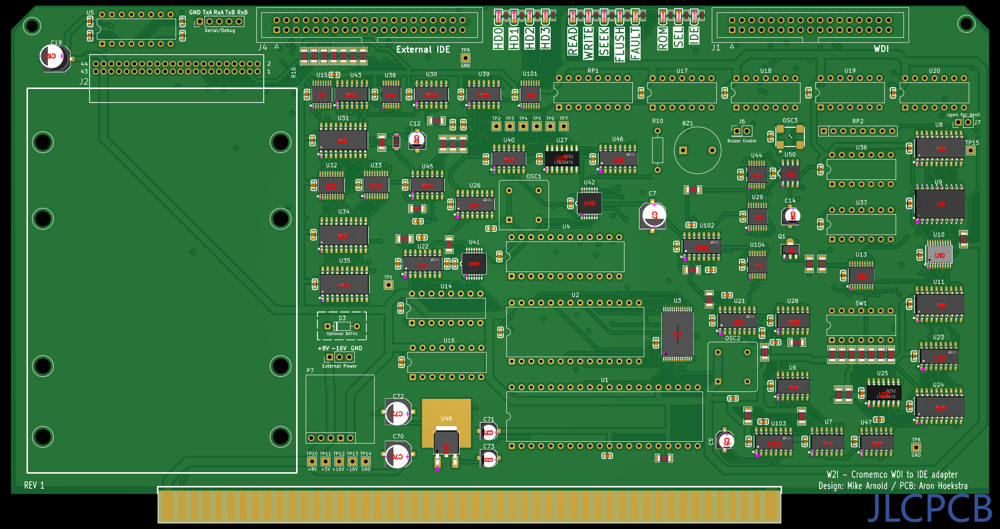
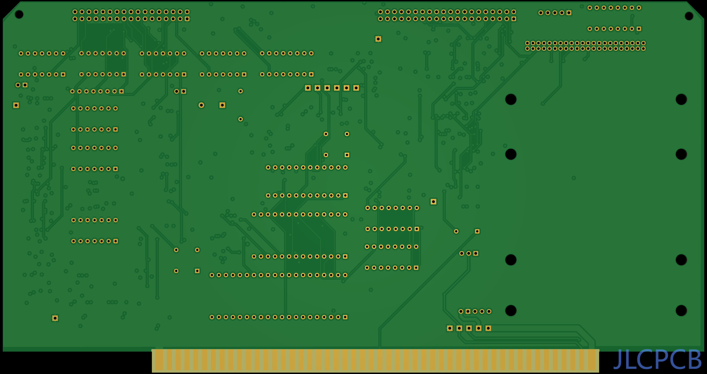

S-100 Board Version of Mike Arnold's W2I (WDI to IDE adapter), for emulating up to four 11Mb IMI7710A drives. It is compatible with CDOS, Z80 Cromix, 68000 Cromix and Cromix Plus. It works with the Cromemco WDI and WDI-II controller. 

